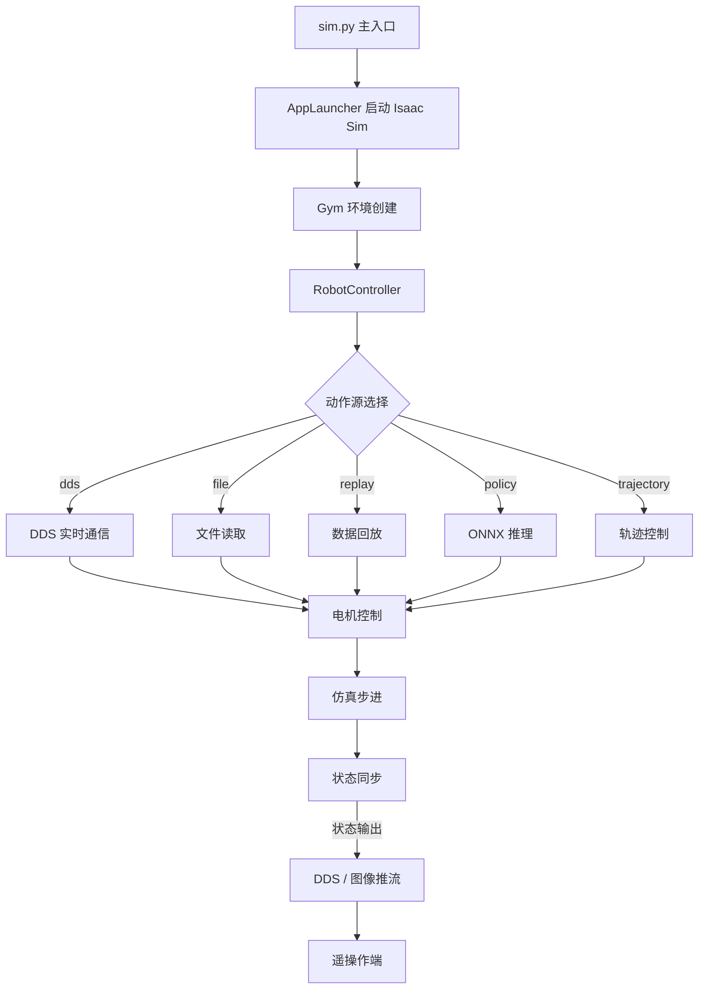

# Unitree Isaac Sim

基于 [NVIDIA Isaac Lab](https://github.com/isaac-sim/IsaacLab) 的 **Unitree 机器人仿真与控制平台**，用于宇树机器人的遥操作、数据采集与策略部署。

## 功能特性

- **多机器人支持**：G129、H1_2 等宇树机器人平台
- **多末端执行器**：Dex1 夹爪、Dex3 灵巧手、Inspire 手
- **多任务场景**：Pick & Place、Stack、Move 等操作任务（Cylinder / RedBlock / RgyBlock）
- **多动作源**：
  - `dds` — 通过 DDS 实时遥操作
  - `dds_wholebody` — 全身运动 DDS 控制
  - `file` — 从文件读取动作序列
  - `replay` — 回放录制的数据
  - `trajectory` — 轨迹控制器
  - `policy` — ONNX 模型策略推理
- **实时图像推流**：支持 WebRTC 公有/私有网络推流
- **摄像机 JPEG 压缩**：可配置压缩质量，减少带宽占用
- **性能分析**：内置频率统计与 Profiling 工具
- **DDS 通信**：基于 DDS 的仿真状态同步与位姿重置

## 环境依赖

- Ubuntu 22.04 / 24.04
- [NVIDIA Isaac Sim](https://developer.nvidia.com/isaac-sim) (4.x+)
- [Isaac Lab](https://github.com/isaac-sim/IsaacLab)
- Python 3.10+
- PyTorch（CUDA 支持）

### 主要 Python 依赖

```
gymnasium
torch
pinocchio
isaaclab
```

## 项目结构

```
unitree_isaacsim/
├── sim.py                          # 主仿真入口
├── unitree_sim_isaaclab/           # Git 子模块 — Unitree 仿真扩展
├── tasks/                          # 任务定义
├── dds/                            # DDS 通信模块
├── action_provider/                # 动作源适配器
├── layeredcontrol/                 # 分层机器人控制器
├── tools/                          # 工具集（数据加载、相机、光照等）
├── teleimager/                     # 图像推流服务
└── data/                           # 数据录制目录
```

## 快速开始

### 1. 克隆仓库

```bash
git clone https://github.com/Magicgravel/unitree_isaacsim.git
cd unitree_isaacsim
git submodule update --init --recursive --depth 1
```

下载 `assets.zip` 解压到项目根目录

[assets.zip](https://huggingface.co/datasets/unitreerobotics/unitree_sim_isaaclab_usds/resolve/main/assets.zip?download=true)

### 2. 配置 Isaac Lab 环境

[Installing Isaac Sim and Isaac Lab](https://isaac-sim.github.io/IsaacLab/main/source/setup/installation/pip_installation.html)

### 3. 运行仿真

#### 基础 Pick & Place 任务（Dex1 夹爪）

```bash
python sim.py --device cpu --enable_cameras \
  --task Isaac-PickPlace-Cylinder-G129-Dex1-Joint \
  --enable_dex1_dds --robot_type g129
```

#### Dex3 灵巧手任务

```bash
python sim.py --device cpu --enable_cameras \
  --task Isaac-PickPlace-Cylinder-G129-Dex3-Joint \
  --enable_dex3_dds --robot_type g129
```

#### Inspire 手任务

```bash
python sim.py --device cpu --enable_cameras \
  --task Isaac-PickPlace-Cylinder-G129-Inspire-Joint \
  --enable_inspire_dds --robot_type g129
```

#### 全身运动控制（Wholebody）

```bash
python sim.py --device cpu --enable_cameras \
  --task Isaac-Move-Cylinder-G129-Dex1-Wholebody \
  --robot_type g129 --enable_dex1_dds
```

#### Headless 模式（无渲染）

```bash
python sim.py --headless --no_render --device cuda \
  --task Isaac-PickPlace-Cylinder-G129-Dex1-Joint \
  --enable_dex1_dds --robot_type g129
```

## 命令行参数

| 参数 | 类型 | 默认值 | 说明 |
|------|------|--------|------|
| `--task` | str | `Isaac-PickPlace-G129-Head-Waist-Fix` | 任务名称 |
| `--action_source` | str | `dds` | 动作来源：`dds` / `dds_wholebody` / `replay` (Disable: `file` / `trajectory` / `policy`) |
| `--robot_type` | str | `g129` | 机器人类型：`g129` / `h1_2` |
| `--enable_dex1_dds` | flag | False | 启用 Dex1 夹爪 DDS 控制 |
| `--enable_dex3_dds` | flag | False | 启用 Dex3 灵巧手 DDS 控制 |
| `--enable_inspire_dds` | flag | False | 启用 Inspire 手 DDS 控制 |
| `--enable_wholebody_dds` | flag | False | 启用全身 DDS 控制 |
| `--no_render` | flag | False | 关闭渲染更新 |
| `--livestream_type` | int | `2` | 推流类型：0=关闭 1=WebRTC公网 2=WebRTC内网 |
| `--public_ip` | str | `127.0.0.1` | 公网推流 IP |
| `--step_hz` | int | `100` | 控制频率 (Hz) |
| `--physics_dt` | float | None | 物理步长（如 `0.005`） |
| `--render_interval` | int | None | 渲染间隔步数 |
| `--camera_jpeg` | flag | True | 启用 JPEG 压缩 |
| `--camera_jpeg_quality` | int | `85` | JPEG 质量 (1-100) |
| `--camera_include` | str | `front_camera,...` | 启用的相机列表（逗号分隔） |
| `--camera_exclude` | str | `world_camera` | 禁用的相机列表（逗号分隔） |
| `--solver_iterations` | int | None | PhysX 求解器迭代次数 |
| `--physx_substeps` | int | None | PhysX 子步数 |
| `--gravity_z` | float | None | 重力 Z 分量（如 `-9.8`） |
| `--seed` | int | `42` | 环境随机种子 |
| `--modify_light` | flag | False | 修改场景光照 |
| `--modify_camera` | flag | False | 修改相机参数 |
| `--generate_data` | flag | False | 生成训练数据 |
| `--replay_data` | flag | False | 回放模式 |
| `--file_path` | str | — | 数据文件路径（`action_source=file` 时使用） |
| `--model_path` | str | `assets/model/policy.onnx` | ONNX 策略模型路径 |
| `--enable_profiling` | flag | True | 启用性能分析 |
| `--profile_interval` | int | `500` | 性能分析报告间隔（步数） |
| `--stats_interval` | float | `10.0` | 频率统计打印间隔（秒） |

## 任务列表

### G129 + Dex1（夹爪）
- `Isaac-PickPlace-Cylinder-G129-Dex1-Joint`
- `Isaac-PickPlace-RedBlock-G129-Dex1-Joint`
- `Isaac-Stack-RgyBlock-G129-Dex1-Joint`
- `Isaac-Move-Cylinder-G129-Dex1-Wholebody`

### G129 + Dex3（灵巧手）
- `Isaac-PickPlace-Cylinder-G129-Dex3-Joint`
- `Isaac-PickPlace-RedBlock-G129-Dex3-Joint`
- `Isaac-Stack-RgyBlock-G129-Dex3-Joint`
- `Isaac-Move-Cylinder-G129-Dex3-Wholebody`

### G129 + Inspire（灵巧手）
- `Isaac-PickPlace-Cylinder-G129-Inspire-Joint`
- `Isaac-PickPlace-RedBlock-G129-Inspire-Joint`
- `Isaac-Stack-RgyBlock-G129-Inspire-Joint`
- `Isaac-Move-Cylinder-G129-Inspire-Wholebody`

### H1_2 + Inspire
- `Isaac-PickPlace-Cylinder-H12-27dof-Inspire-Joint`
- `Isaac-PickPlace-RedBlock-H12-27dof-Inspire-Joint`
- `Isaac-Stack-RgyBlock-H12-27dof-Inspire-Joint`

## 架构概览


